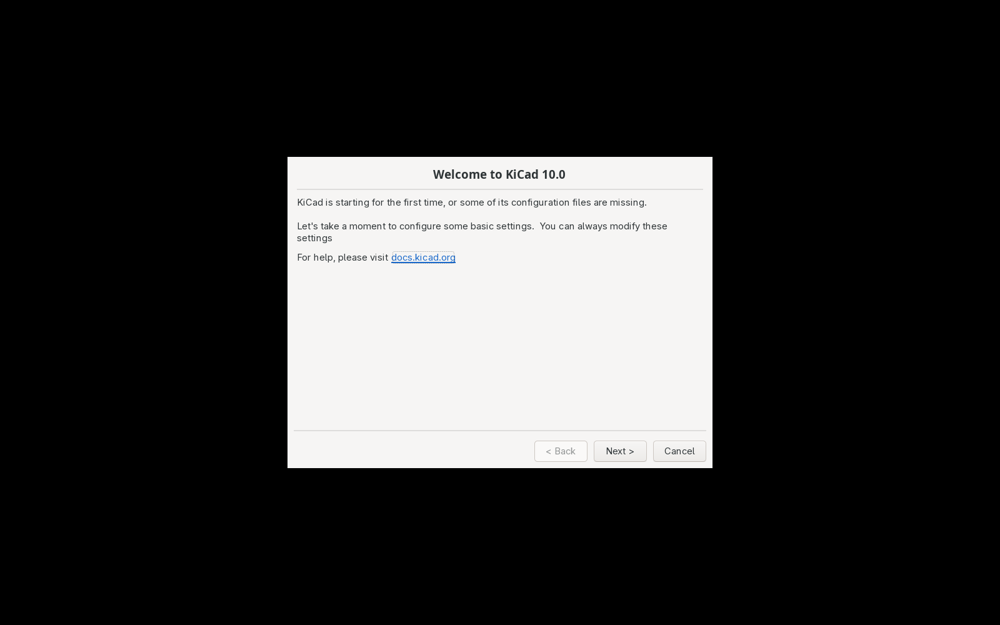
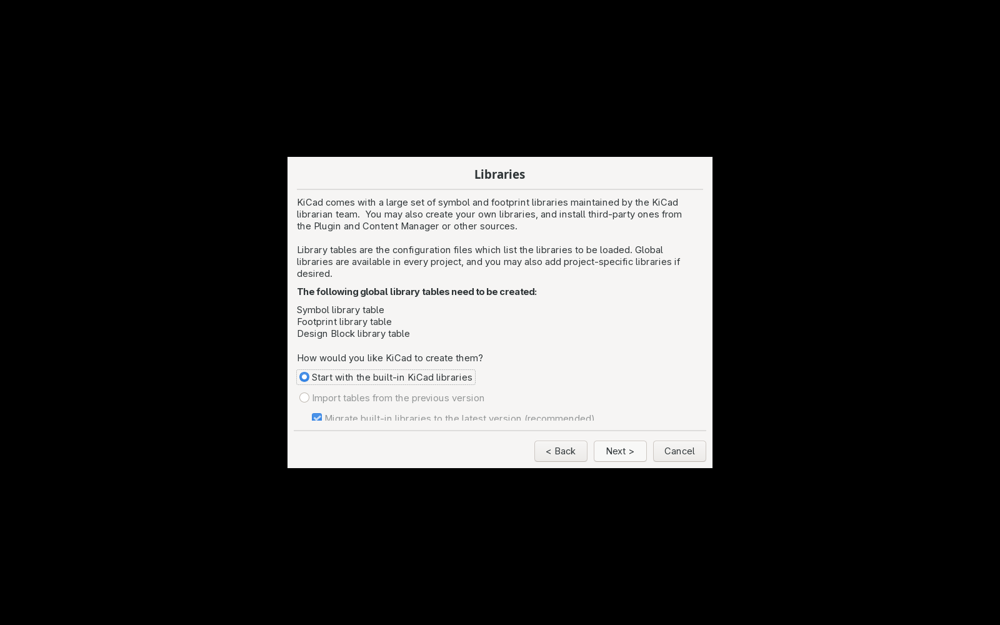
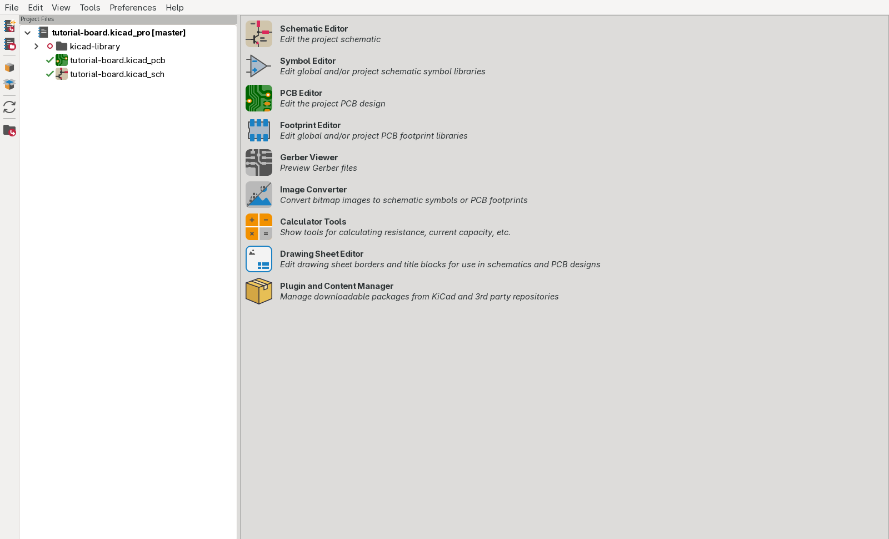
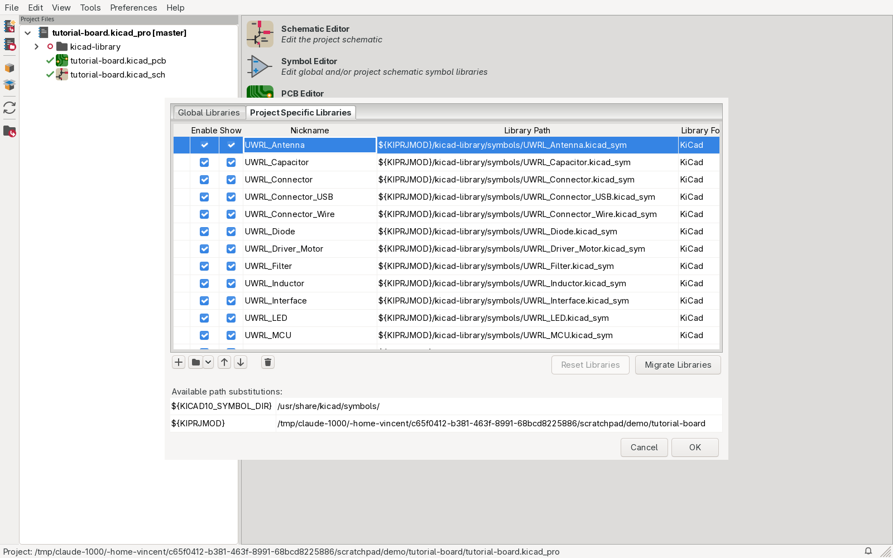
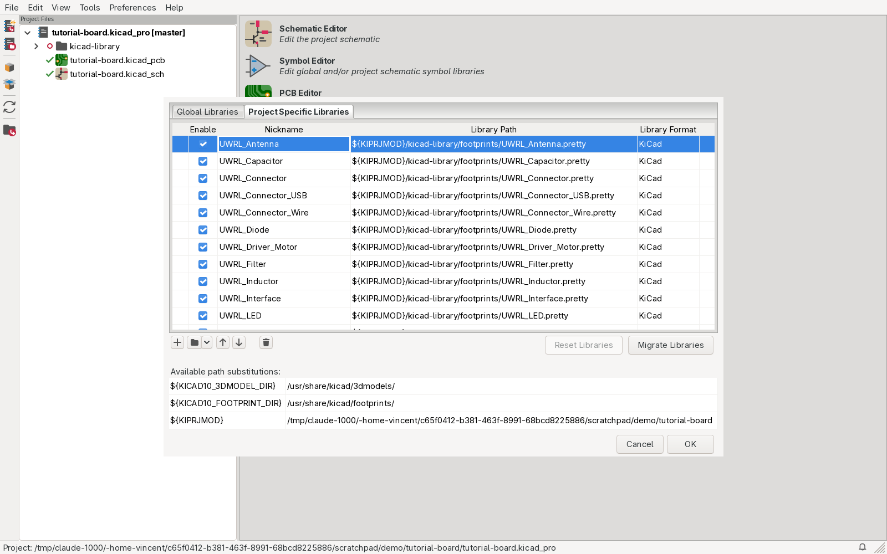

# 1: Setup: KiCad, Git and the library

## Install KiCad 10

Download the 10.x release from <https://www.kicad.org/download/>.

- Windows: run the installer, keep the default components (the stock libraries are needed).
- macOS: open the `.dmg`, drag KiCad to Applications. Open it once from Applications so macOS trusts it.
- Linux: use your distribution's package (`sudo pacman -S kicad kicad-library kicad-library-3d` on Arch;
  Ubuntu users add the `ppa:kicad/kicad-10-releases` PPA, then `sudo apt install kicad`).

Launch KiCad. The first-run wizard appears. Click Next on every page and keep the defaults, in
particular "Copy default global symbol library table (recommended)" and the same for footprints.
That gives you the stock KiCad libraries. The team library is added per project, below.


*The first-run wizard. Next, Next, Finish.*


*Keep "Copy default global symbol library table". Never point these global tables at the team library.*

## Install Git

- Windows: <https://git-scm.com/download/win>, keep the defaults.
- macOS: run `xcode-select --install` in Terminal, or install from git-scm.com.
- Linux: `sudo pacman -S git` or `sudo apt install git`.

Optional but handy: the GitHub CLI, <https://cli.github.com/>, then `gh auth login`.

Tell Git who you are:

```sh
git config --global user.name "Your Name"
git config --global user.email "you@uwaterloo.ca"
```

## Get a project with the library in it

Every Reality Labs board repository carries the library as a submodule at `kicad-library/`, next to
the `.kicad_pro` file. Clone with the submodule:

```sh
git clone --recurse-submodules https://github.com/uwrealitylabs/<project>
```

Already cloned without it? Run `git submodule update --init` inside the project.

## Or start a new project

```sh
mkdir my-board && cd my-board
git init
git submodule add https://github.com/uwrealitylabs/kicad-library kicad-library
cp kicad-library/templates/4layer-base/4layer-base.kicad_pro my-board.kicad_pro
cp kicad-library/templates/4layer-base/4layer-base.kicad_sch my-board.kicad_sch
cp kicad-library/templates/4layer-base/4layer-base.kicad_pcb my-board.kicad_pcb
python3 kicad-library/scripts/libtables.py .
```

The template is the JLCPCB 4-layer stackup with our design rules and net classes. Prefer the KiCad
way? Install the templates once (`templates/install.ps1` on Windows, or copy `templates/4layer-base`
into your user template folder), then File → New Project from Template… and add the submodule after.

`libtables.py` writes `sym-lib-table` and `fp-lib-table` into the project folder with one row per
`UWRL_*` library. Commit both files with the project; they are part of the board.

Open the project in KiCad (File → Open Project…, pick the `.kicad_pro`).


*The project manager. `kicad-library/` sits next to the project files.*

## Check the library is wired in

Preferences → Manage Symbol Libraries…, then the Project Specific Libraries tab. Every `UWRL_*`
library is listed with a `${KIPRJMOD}/kicad-library/...` path.


*Project Specific Libraries: one row per UWRL category. The Global tab holds the stock libraries only.*

Preferences → Manage Footprint Libraries…, same tab, same check.


*Footprint libraries, project tab.*

Nothing listed? Run `python3 kicad-library/scripts/libtables.py .` again from the project folder and
re-open the project. Rows shown in red mean the submodule folder is empty: `git submodule update --init`.

## Why a submodule and why `${KIPRJMOD}`

A submodule is a pointer to one exact commit of the library. Your board records which library commit
it was drawn against, so opening it in a year, or on a teammate's laptop, gives the same symbols and
footprints. `${KIPRJMOD}` is KiCad's variable for "the folder that holds the project file", so every
path inside the library resolves on every machine without anyone editing a global setting.

Do not copy library files into your project, and do not add the team library to the global tables.
Both break the pin and make review impossible.

## Update to a newer library

```sh
cd kicad-library
git pull origin main
cd ..
git add kicad-library
git commit -m "bump kicad-library"
```

If the update added a new category, run `python3 kicad-library/scripts/libtables.py .` again.
Restart KiCad after either step so it re-reads the tables.

Next: [2: Finding parts](02-finding-parts.md)
