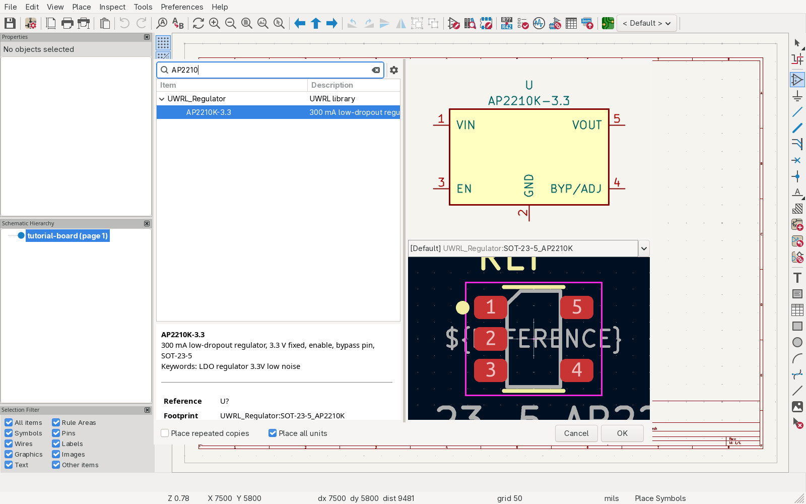

# 2: Finding parts before you make them

Making a part takes an hour. Finding one takes a minute. Search in this order, every time.

## 1. Stock KiCad libraries

KiCad ships thousands of symbols and footprints. In the Schematic Editor press `A` (Place → Add
Symbol) and type the part number, or the family, or the package (`AP2210`, `LM317`, `SOT-23-5`).
The chooser searches names, descriptions and keywords across every library at once.

Stock footprints live in libraries named by package: `Package_TO_SOT_SMD`, `Package_QFP`,
`Package_DFN_QFN`, `Capacitor_SMD`, `Resistor_SMD`, `Connector_JST`, `Connector_USB` and so on.
A stock symbol usually comes with its footprint already assigned; check the package against the
datasheet anyway (a QFN-20 comes in more than one size).

If stock has the exact part: use it, there is nothing to submit.
If stock has the package but not the part: you make only the symbol and link the stock footprint.

## 2. The team library

The same chooser searches the `UWRL_*` libraries. They hold what stock does not: parts somebody on
the team already checked against a datasheet and, in most cases, soldered.

*The symbol chooser with a UWRL part selected. The preview on the right is the symbol; the footprint preview is below it.*

| library | what is in it |
|---|---|
| `UWRL_Antenna` | chip antennas |
| `UWRL_Capacitor` | specific capacitor part numbers (JLC basic parts, electrolytics, hybrids) |
| `UWRL_Resistor` | specific resistor part numbers (JLC basic parts) |
| `UWRL_Inductor` | inductors and ferrite beads |
| `UWRL_Filter` | common-mode chokes and filters |
| `UWRL_Connector` | board-to-board, FFC/FPC, RF, pogo, debug and hot-swap connectors |
| `UWRL_Connector_Wire` | wire-to-board: JST SH 1.0, XH 2.54, screw terminals, Qwiic |
| `UWRL_Connector_USB` | USB-C and USB-A receptacles |
| `UWRL_Diode` | rectifiers, Schottky, Zener, TVS and ESD diodes |
| `UWRL_LED` | LEDs, addressable LEDs |
| `UWRL_Oscillator` | crystals, oscillators, TCXOs, clock generators |
| `UWRL_Switch` | tactile and slide switches |
| `UWRL_Mechanical` | standoffs, logos, mounting hardware |
| `UWRL_MCU` | microcontrollers (RP2040, STM32, CH32, ESP32, AT32) |
| `UWRL_Memory` | flash and DRAM |
| `UWRL_Interface` | USB, CAN, isolators, analog multiplexers |
| `UWRL_Regulator` | linear and switching regulators |
| `UWRL_Power_Management` | PMICs, load switches |
| `UWRL_Driver_Motor` | motor drivers |
| `UWRL_Sensor` | IMUs, magnetic sensors |
| `UWRL_Transistor` | BJTs and MOSFETs |
| `UWRL_Power` | power symbols (VBUS variants) |

Found it but it is wrong (a pin type, a missing pad)? Fix it and submit the fix as a pull request,
document 5, saying what was wrong.

## 3. Make it

Not in stock, not in the library: make it. Documents 3 and 4 show how, on a real part.

## Where parts come from

Boards are assembled at JLCPCB with parts from LCSC. Every LCSC part has a `C` number
(`C176959`); it goes into the symbol's `LCSC` field and is what the assembly order is built from.
JLC "basic" parts are stocked on every machine and cost nothing extra to place; "extended" parts add
a small per-part fee, so a basic part wins when two are equivalent. Parts we solder ourselves come
from DigiKey or Mouser.

The datasheet is the manufacturer's PDF. Find it on the manufacturer's site (or through the
LCSC/DigiKey product page, then follow the link to the PDF). The product page itself is not a
datasheet; the `Datasheet` field takes the PDF URL.

Next: [3: Making a symbol](03-making-a-symbol.md)
