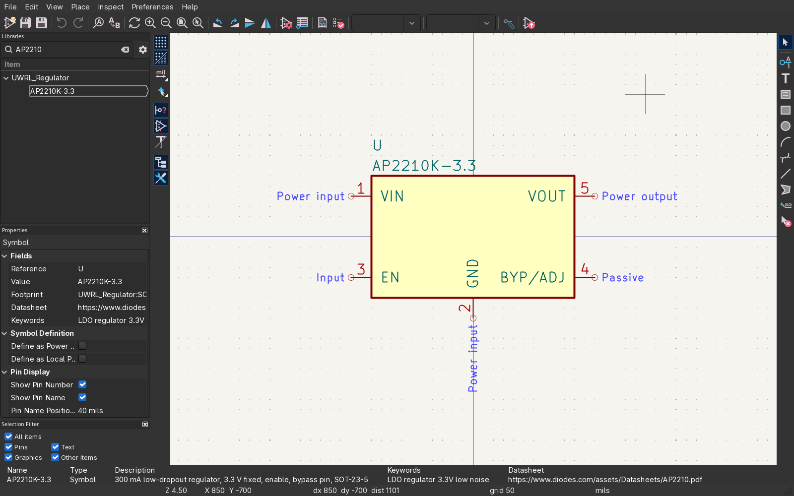
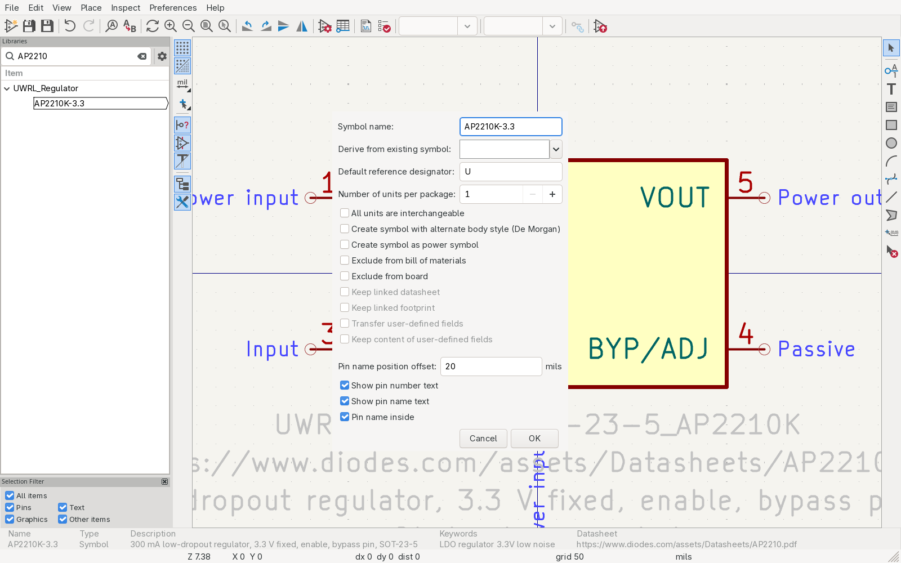
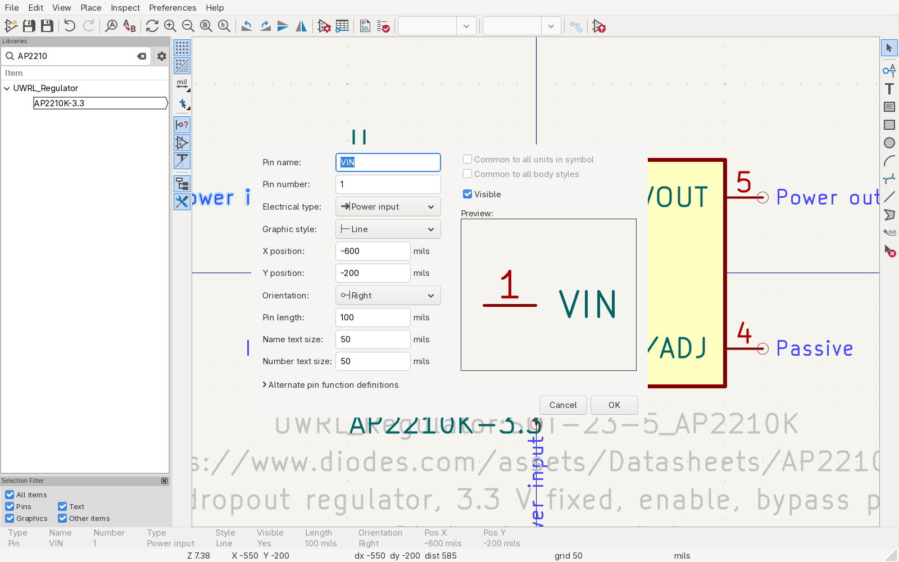
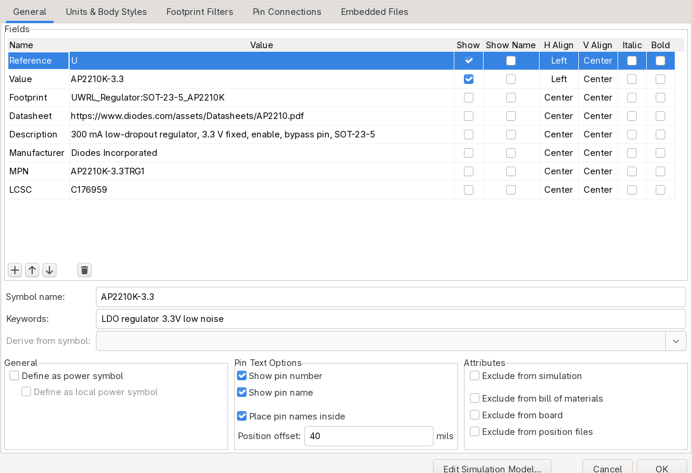
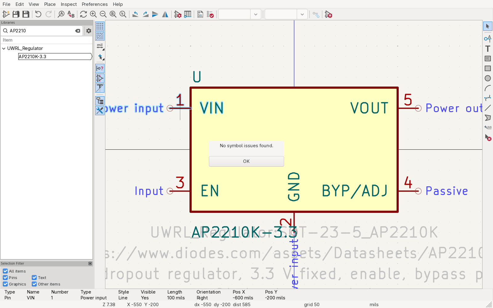

# 3: Making a symbol

The worked example is the AP2210K-3.3, a 300 mA low-dropout regulator from Diodes Incorporated,
SOT-23-5 package. Open the datasheet now and keep it open:
<https://www.diodes.com/assets/Datasheets/AP2210.pdf>. Page 3 has the pin table ("Pin Descriptions", SOT23-5 column):

| pin | name | electrical type in KiCad | why |
|---|---|---|---|
| 1 | VIN | Power input | a supply pin; ERC wants it driven by a power source |
| 2 | GND | Power input | same |
| 3 | EN | Input | a logic input |
| 4 | BYP/ADJ | Passive | bypass capacitor to GND for low noise (10 nF); on the fixed 3.3 V part it only ever sees a capacitor |
| 5 | VOUT | Power output | the regulator drives this net; ERC flags two outputs fighting |

Order code: MPN `AP2210K-3.3TRG1` (the `TRG1` is the reel), LCSC `C176959`.

> **House style, every symbol**
> Supplies at the top, GND at the bottom. Inputs on the left, outputs on the right. Group pins by
> function, not by pin number. Pin names and numbers exactly as the datasheet. Pins on the 50 mil
> (1.27 mm) grid. No project-specific text in the symbol: the symbol is the chip, the board is the
> context.

## Open the Symbol Editor on the team library

From the project manager click Symbol Editor. In the library tree on the left, the project's
libraries show a small project icon; the stock libraries do not. Find `UWRL_Regulator` and click it.
Only ever edit `UWRL_*` libraries. Stock libraries are overwritten by the next KiCad update.


*The Symbol Editor with the tree filtered to `UWRL_Regulator`, showing the finished symbol this
document builds. The blue labels are the pin electrical types.*

## Create the symbol

File → New Symbol…. Fill in:

- Symbol name: `AP2210K-3.3`
- Default reference designator: `U` (ICs are `U`; connectors `J`, resistors `R`, capacitors `C`,
  inductors `L`, diodes `D`, transistors `Q`, crystals `Y`, switches `SW`)
- Number of units: 1. Leave the other boxes at their defaults.


*New Symbol. Name and reference designator are the two fields that matter.*

Click OK. An empty canvas opens with the reference and value text placed.

## Draw the body

Place → Add Rectangle (or the rectangle tool on the right toolbar). Click two opposite corners,
about 15 mm wide by 10 mm tall, centred on the origin. Keep the grid at 50 mil (1.27 mm); the grid
selector is in the top toolbar. Set the fill to "Fill with body background color" (double-click the
rectangle to edit it) so the body reads as a chip.

## Add the pins

Place → Add Pin (`P`). The Pin Properties dialog opens for each pin:

- Pin name and Pin number as the table above.
- Electrical type as the table above.
- Orientation: Right for pins on the left edge (the pin points into the body), Left for pins on the
  right edge, Up for the bottom edge.
- Pin length: 2.54 mm (100 mil).


*Pin Properties for VIN: number 1, Power input, 2.54 mm long.*

Place them following the house style:

- `VIN` (1) on the left edge, upper. `EN` (3) on the left edge, below it.
- `VOUT` (5) on the right edge, upper. `BYP/ADJ` (4) on the right edge, lower.
- `GND` (2) on the bottom edge, centred.

The end of the pin with the small circle is the connection point. It must sit on the grid and point
away from the body; wires will not snap to a pin that is off grid.

Hover a placed pin and press `E` to edit it, `R` to rotate, `M` to move.

## Fill in the properties

File → Symbol Properties…. Add or edit the fields:

| field | value | shown on schematic |
|---|---|---|
| Reference | `U` | yes |
| Value | `AP2210K-3.3` | yes |
| Footprint | `UWRL_Regulator:SOT-23-5_AP2210K` (made in document 4) | no |
| Datasheet | `https://www.diodes.com/assets/Datasheets/AP2210.pdf` | no |
| Description | `300 mA low-dropout regulator, 3.3 V fixed, enable, bypass pin, SOT-23-5` | no |
| Manufacturer | `Diodes Incorporated` | no |
| MPN | `AP2210K-3.3TRG1` | no |
| LCSC | `C176959` | no |

Add a field with the `+` button under the table. Untick Show for everything except Reference and
Value. Description, Manufacturer, MPN and LCSC are what the BOM, the assembly order and the reviewer
read; the schematic only needs the reference and value.


*Symbol Properties. Footprint, Datasheet, MPN and LCSC filled, hidden from the schematic.*

The Footprint field can point at a stock footprint too (`Package_TO_SOT_SMD:SOT-23-5`). Document 4
explains when to use stock and when to make your own.

## Check and save

Inspect → Symbol Checker. It must report nothing: no off-grid pins, no duplicate numbers, no missing
electrical types. Fix anything it lists.


*Symbol Checker with nothing to report. This is what the reviewer expects to see.*

Press Ctrl+S. That writes the whole library file, `symbols/UWRL_Regulator.kicad_sym`, inside the
submodule. Confirm that is the only change:

```sh
cd kicad-library
git status
git diff --stat
```

One file changed. If you see other files, you edited the wrong library or saved a stray copy.

Next: [4: Making a footprint](04-making-a-footprint.md)
