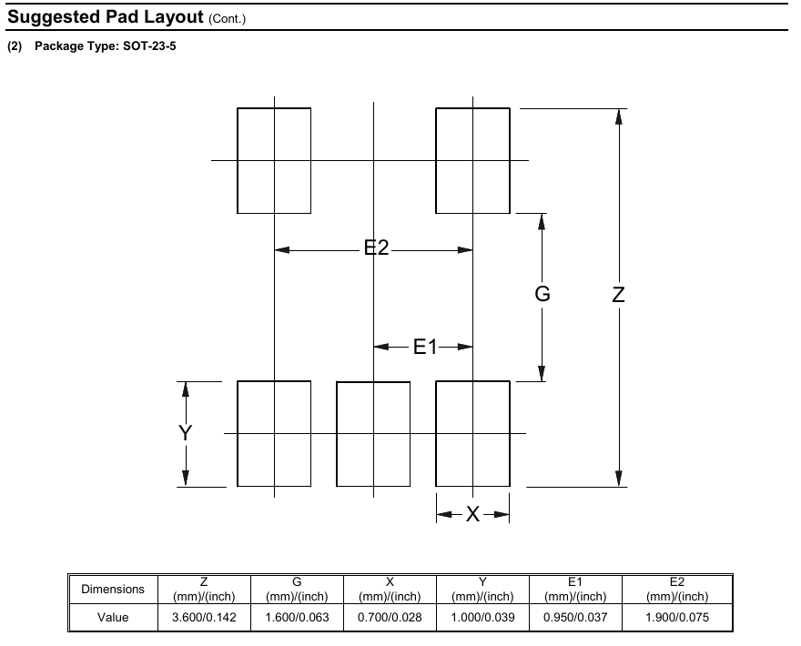
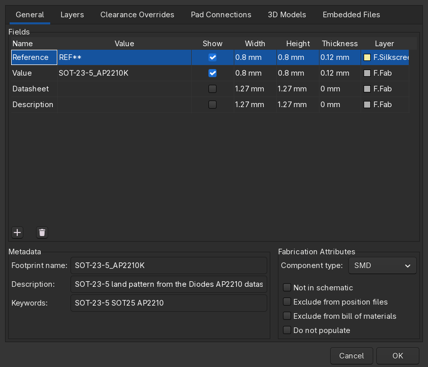
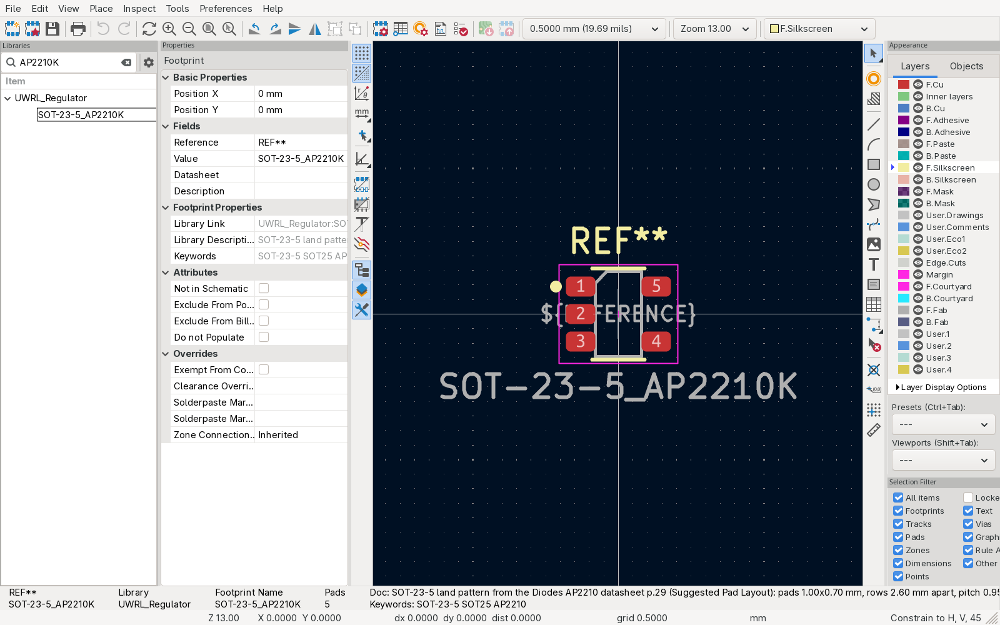
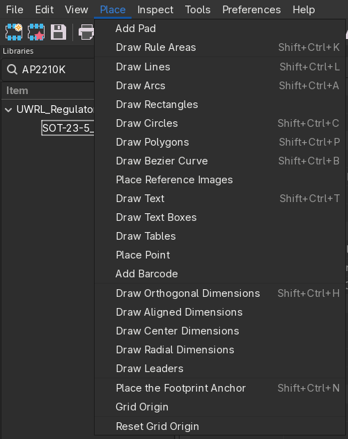
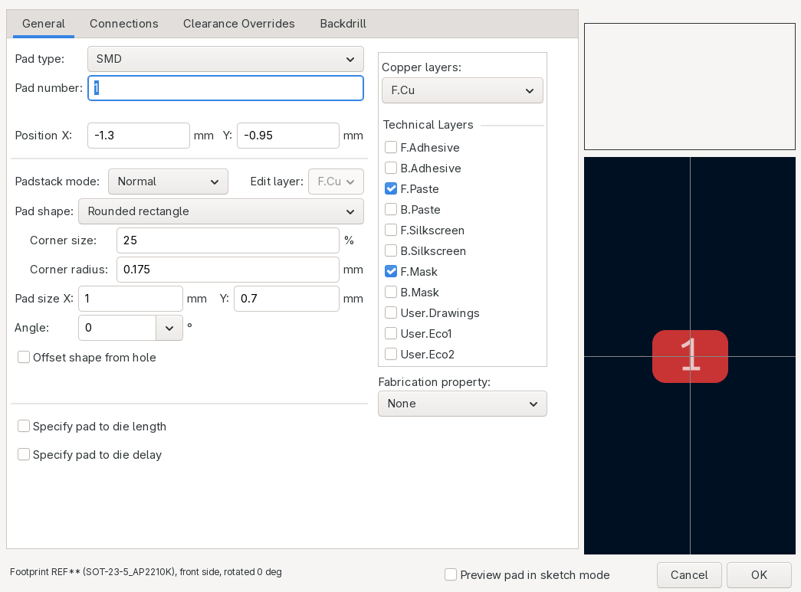
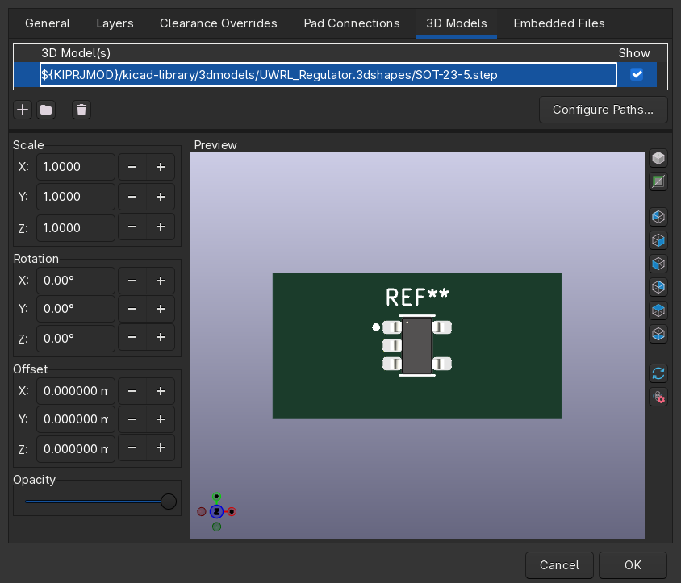
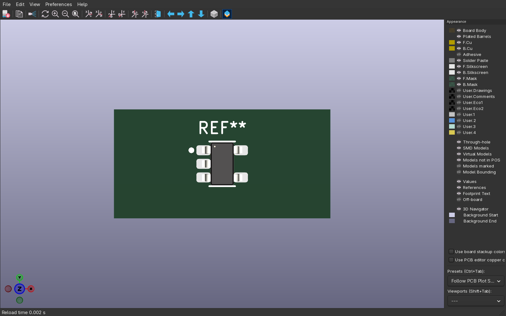
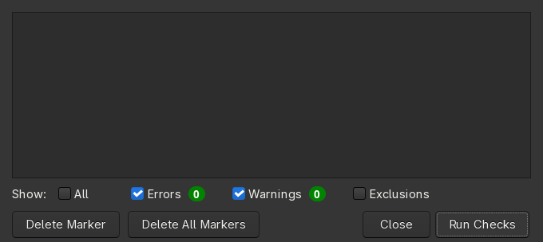

# 4: Making a footprint and attaching the 3D model

## Stock first

Stock KiCad has `Package_TO_SOT_SMD:SOT-23-5`. Use a stock footprint when its pads match the land
pattern the datasheet recommends; the reviewer checks exactly that.

Open the AP2210 datasheet at page 29, "Suggested Pad Layout", SOT25 (Diodes' name for SOT-23-5):

| symbol | value | meaning |
|---|---|---|
| Z | 3.60 mm | outer edge to outer edge of the two pad rows |
| G | 1.60 mm | gap between the rows |
| X | 0.70 mm | pad width (along the pin pitch) |
| Y | 1.00 mm | pad length (across the package) |
| E1 | 0.95 mm | pin pitch |
| E2 | 1.90 mm | outer pin to outer pin (2 x E1) |


*Datasheet page 29, Suggested Pad Layout for SOT-23-5. Z, G, X, Y, E1 and E2 are the table above.*

Row centres sit (Z + G) / 2 = 2.60 mm apart, so the pads go at X = -1.30 mm and X = +1.30 mm.

Stock `SOT-23-5` uses 1.06 x 0.65 mm pads with rows 2.20 mm apart. Different pattern, so we make one
named after the part: `SOT-23-5_AP2210K`. When the numbers do match stock, put the stock name in the
symbol's Footprint field and skip the rest of this document.

## Create the footprint

From the project manager click Footprint Editor. In the library tree pick `UWRL_Regulator` (the one
with the project icon). File → New Footprint (Ctrl+N) opens an empty footprint called `Untitled`.
File → Footprint Properties…, General tab:

- Footprint name: `SOT-23-5_AP2210K`
- Component type: SMD
- Description: where the land pattern came from (`SOT-23-5 land pattern from the Diodes AP2210
  datasheet p.29`); Keywords: `SOT-23-5 SOT25 AP2210`


*Footprint Properties. Name, description, keywords and component type live here.*


*The finished footprint: five pads, fabrication outline, silkscreen, courtyard.*

## Pads

Place → Add Pad, click roughly where the pad goes, then double-click it to open Pad Properties.


*Place menu: Add Pad, then Draw Lines and Draw Rectangles for the outline, silkscreen and courtyard.*
Pad numbers must equal the symbol's pin numbers; that is the only link between the two.
Footprint coordinates have Y pointing down, so a negative Y is above the centre.

| pad | X | Y |
|---|---|---|
| 1 | -1.30 | -0.95 |
| 2 | -1.30 | 0.00 |
| 3 | -1.30 | 0.95 |
| 4 | 1.30 | 0.95 |
| 5 | 1.30 | -0.95 |

For every pad: Pad type SMD, Shape Rounded rectangle, Size X 1.00 mm, Size Y 0.70 mm,
Copper layers F.Cu, Technical layers F.Paste and F.Mask.


*Pad Properties for pad 1. The number, the size and the position come from the datasheet table.*

Pin 1 goes bottom-left when the package is viewed from above with the pins running top to bottom,
which is how the datasheet draws it: pins 1, 2, 3 down the left, 5 and 4 up the right. Check this
against the pin diagram on datasheet page 1 before going further; a mirrored footprint is the most
common footprint bug there is.

## Outline, silkscreen, courtyard

Select the layer in the Layers panel on the right, then Place → Add Line or Add Rectangle.

- `F.Fab`: the package body, 1.60 mm wide by 2.90 mm tall (datasheet page 27, package outline). Cut the
  top-left corner to mark pin 1. Line width 0.10 mm.
- `F.SilkS`: two short lines along the top and bottom of the body, kept clear of the pads, and a
  filled circle beside pad 1. Silkscreen on a pad prints on copper and is a fabrication error.
- `F.CrtYd`: one closed rectangle 0.25 mm outside everything, here from (-2.05, -1.70) to
  (2.05, 1.70). The courtyard is what the placement checks use to keep parts from overlapping;
  a footprint without one gets rejected in review.
- The `REF**` text sits on `F.SilkS` above the part; a `${REFERENCE}` text on `F.Fab` is placed on
  the body.

## Attach the 3D model

Get the STEP file first. In order of preference: the manufacturer's site, the JLCPCB/EasyEDA part
page (the LCSC part number gets you there), SnapEDA or Ultra Librarian, or KiCad's own stock
`packages3d` when the package is the same (it is here: `Package_TO_SOT_SMD.3dshapes/SOT-23-5.step`).
Copy it into the library:

```
kicad-library/3dmodels/UWRL_Regulator.3dshapes/SOT-23-5.step
```

File → Footprint Properties…, 3D Models tab, click the `+` and enter the path with the project
variable, never an absolute path from your machine:

```
${KIPRJMOD}/kicad-library/3dmodels/UWRL_Regulator.3dshapes/SOT-23-5.step
```


*3D Models tab. The path starts with `${KIPRJMOD}/kicad-library/` so it resolves on every machine.*

View → 3D Viewer. The body must sit on the pads with pin 1 over pad 1. Rotate or offset the model
in the same tab if the vendor file is oriented differently.


*The 3D viewer with the STEP body on the pads.*

## Check and save

Inspect → Footprint Checker. It must report nothing: no pads without a number, no silkscreen over
copper, courtyard closed.


*A clean Footprint Checker.*

Press Ctrl+S. The file `footprints/UWRL_Regulator.pretty/SOT-23-5_AP2210K.kicad_mod` appears inside
the submodule. Confirm with `git status` in `kicad-library/` that you have exactly three changes:
the symbol library, the new footprint file, and the STEP file.

Back in the Symbol Editor, the symbol's Footprint field now resolves: `UWRL_Regulator:SOT-23-5_AP2210K`.

Next: [5: Submitting the part](05-submitting-a-part.md)
