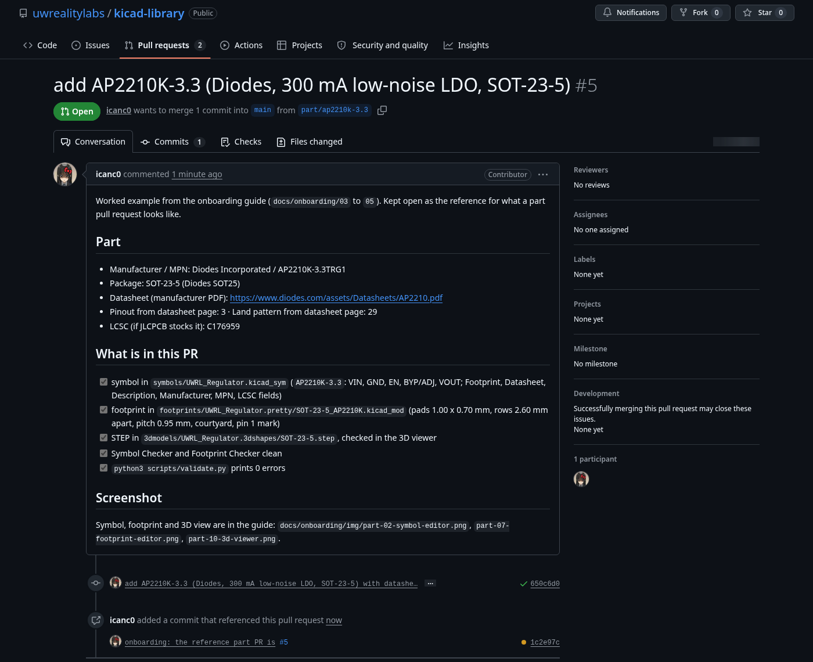

# 5: Submitting the part as a pull request

The library changes through pull requests on <https://github.com/uwrealitylabs/kicad-library>.
One pull request per part (a connector family with the same drawing counts as one). A team member
reviews it against the datasheet and merges it. Nobody pushes to `main`.

The rules the reviewer applies are in [CONTRIBUTING.md](../../CONTRIBUTING.md); this document is the
sequence of commands.

## Branch inside the submodule

The library is its own repository. Everything here happens inside `kicad-library/`, not in the board
project.

```sh
cd kicad-library
git checkout main
git pull origin main
git checkout -b part/ap2210k-3.3-<your-github-username>
```

Branch names: `part/<mpn-lowercase>` for a new part, `fix/<what>` for a correction. The onboarding
part is the one exception: everyone makes the same AP2210K-3.3, so add your GitHub username to the
branch. The reference for it is pull request
[#5](https://github.com/uwrealitylabs/kicad-library/pull/5), which stays open as the example and
is never merged.

## Validate

```sh
python3 scripts/validate.py
```

It must end with `0 errors`. It checks that every symbol's Footprint resolves, every footprint's 3D
path exists and starts with `${KIPRJMOD}/kicad-library/3dmodels/`, names are unique, and KiCad can
load every file. Warnings (a missing LCSC field, a shop link in Datasheet) are worth fixing on your
part but do not block. The same script runs in CI on the pull request.

## Commit

```sh
git add symbols/UWRL_Regulator.kicad_sym
git add footprints/UWRL_Regulator.pretty/SOT-23-5_AP2210K.kicad_mod
git add 3dmodels/UWRL_Regulator.3dshapes/SOT-23-5.step
git status
git commit -m "add AP2210K-3.3 (Diodes, 300 mA LDO, SOT-23-5) with footprint and STEP"
```

Add the three paths by name so a stray backup or a lock file does not go in. The message says what
the part is, who makes it, and which package: the log is the changelog.

## Push and open the pull request

```sh
git push -u origin part/ap2210k-3.3-<your-github-username>
```

Open the link Git prints (or go to the repository, Pull requests, New pull request, pick your
branch). The pull request template asks for:

- manufacturer and MPN, package, the manufacturer datasheet URL
- the datasheet pages you took the pinout and the land pattern from
- the LCSC number if JLCPCB stocks it
- the checklist: symbol, footprint (or the stock one you linked), STEP checked in the 3D viewer,
  both checkers clean, `validate.py` at 0 errors

Attach a screenshot with the symbol and the footprint next to the datasheet's pin diagram. Reviewers
compare exactly that, and it turns a day of back and forth into ten minutes.


*The reference pull request for the AP2210K-3.3 (#5). CI (validate.py) reports at the bottom of the
conversation.*

## Review and merge

CI runs `scripts/validate.py` on every push. The reviewer checks:

- pin numbers and names match the datasheet pin table, electrical types are real
- footprint pads match the recommended land pattern; pad numbers match the symbol
- courtyard closed, pin 1 marked, nothing on the wrong layer
- STEP aligned in the 3D viewer, path is `${KIPRJMOD}/kicad-library/3dmodels/...`
- `Datasheet` is the manufacturer PDF; `MPN`, `Manufacturer`, `LCSC` filled

Requested changes: edit in KiCad, commit on the same branch, push again. The pull request updates.
Once merged, delete the branch. The onboarding pull request gets the same review and is then closed
instead of merged; the library keeps only one copy of each part.

## Bring the merged part into your board

```sh
cd kicad-library
git checkout main
git pull origin main
cd ..
git add kicad-library
git commit -m "bump kicad-library: AP2210K-3.3"
```

## Need the part on your board before it is merged?

Leave the submodule checked out on your branch. The board project records that commit, so the
board builds today and anyone cloning it gets your part. After the merge, bump to `main` as above.
Never copy the part into the board project's own files to skip the pull request; the next person
who needs the part starts from zero.

Next: [6: Using the part](06-using-the-part.md)
