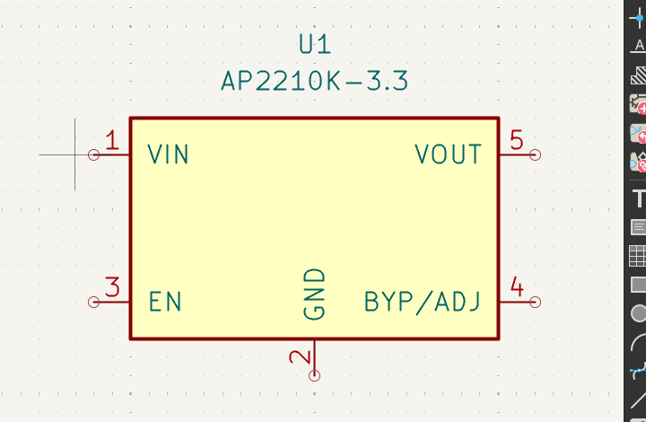
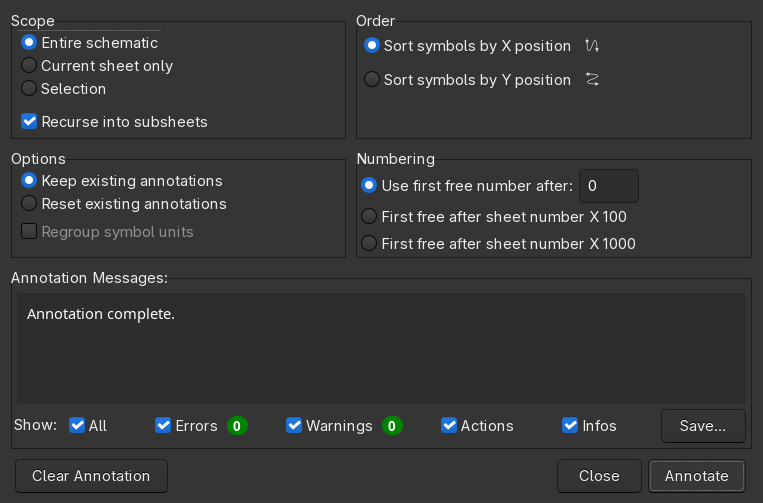
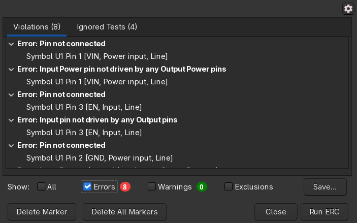
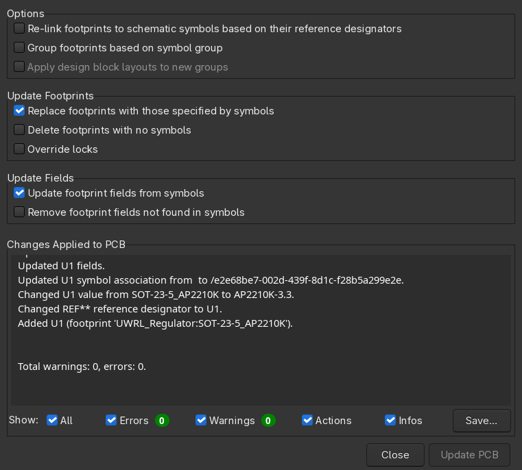
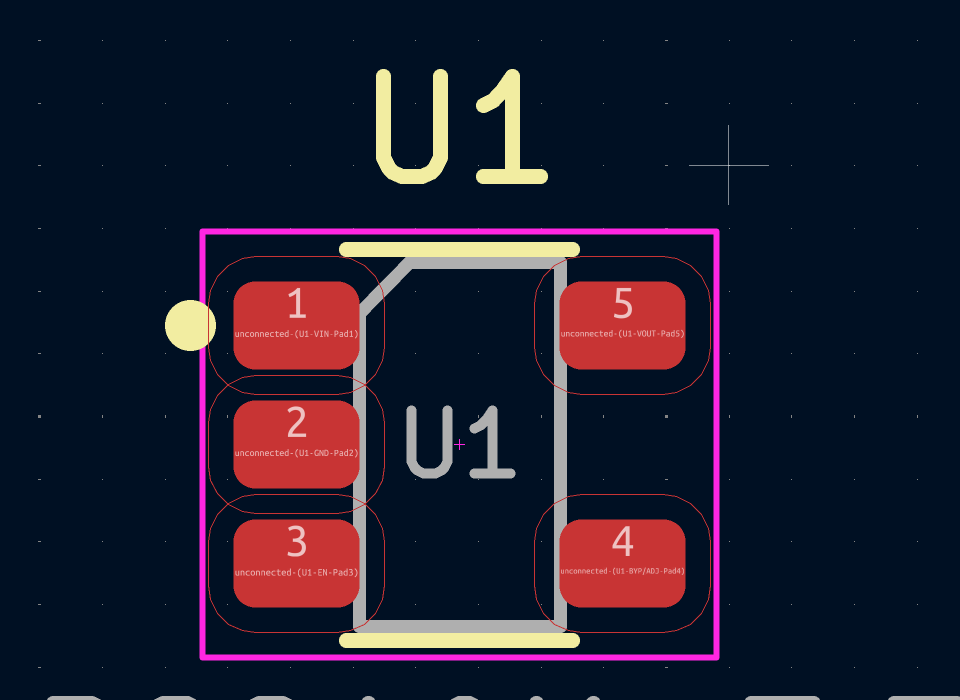
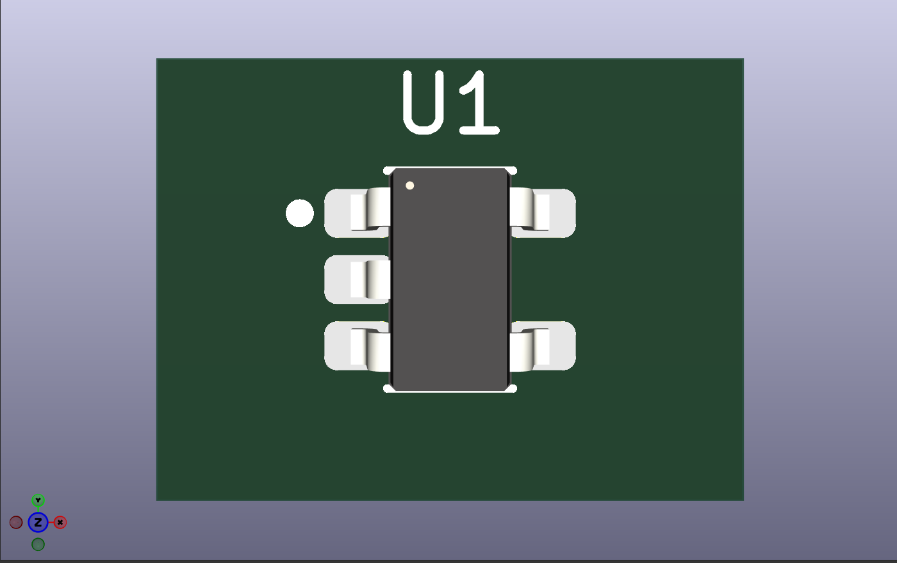

# 6: Using the part on a board

Open the board project and start the Schematic Editor.

## Place it

Press `A` (Place → Add Symbol), type `AP2210` and pick `UWRL_Regulator:AP2210K-3.3`. Click to
place it. The footprint and the datasheet came with it: the symbol carries both fields.

*The symbol on the sheet, straight from the library.*

Wire it as the datasheet's typical application shows: `VIN` from the input rail with a 1 uF ceramic
to GND next to the pin, `VOUT` to the 3.3 V rail with another 1 uF, `EN` tied to `VIN` (always on)
or to a control signal, `GND` to ground. `BYP/ADJ` takes an optional 10 nF capacitor to GND for lower noise; leave it open otherwise.

Select the symbol and press `D` (or right-click, Show Datasheet) to open the PDF from the symbol's
Datasheet field.

## Annotate and check

Tools → Annotate Schematic… gives `U?` a number.

*Annotate Schematic with the defaults. `U?` becomes `U1`.*

Inspect → Electrical Rules Checker must be clean on a finished sheet. The pin electrical types you
set in document 3 are what ERC uses: an unconnected `Power input`, or two `Power output` pins on one
net, shows up here and nowhere else.

*ERC before wiring: every pin is listed, which is the pin types doing their job. Wire the part and
run it again; the list must be empty before you commit.*

## Push it to the board

Tools → Update PCB from Schematic… (`F8`), then Update PCB. The PCB Editor opens with the
`SOT-23-5_AP2210K` footprint attached to the cursor; click to drop it.

*Update PCB from Schematic: U1 arrives with the `UWRL_Regulator:SOT-23-5_AP2210K` footprint and the
symbol's fields.*

*The footprint on the board: pads, courtyard, reference and value.*

View → 3D Viewer (`Alt+3`) shows the STEP body on the pads.

*The 3D viewer. No board outline yet, hence the warning; the part itself is right.*

## Done

Commit the board (`git add -A && git commit`), then ping an EE lead (@Vincent Xie) in Discord
`#onboarding-posts` with the link to your library pull request and the board repository. That is
the onboarding review.

Back to the [index](README.md).
